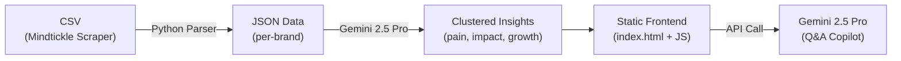

# BrandLens Copilot — Implementation Plan

An interactive intelligence dashboard for Brand Marketing Managers, powered by Mindtickle sales call data and Gemini 2.5 Pro.

## Data Analysis Summary

| Metric | Value |
|---|---|
| Total Rows | 999 |
| Rows with Brand | 401 (40%) |
| Rows with Debrief Fields | ~413 (41%) |
| Rows with Title/URL/Summary | ~457 (46%) |
| Unique Brands | 10 (Flow: 145, Needs Strategic Review: 129, Cured: 30, Comet: 30, Atlas: 21, Gravity: 19, PQS: 10, Galaxy: 8, No Clear Fit: 5, Story Health: 4) |
| Opportunity Stage | Multi-value comma-separated; ~48 unique combinations |

> [!IMPORTANT]
> ~59% of rows have no "Brand Discussed" value, and ~85% are missing Opportunity Name/Stage. The dashboard will surface data completeness rates as KPIs so users understand coverage. Rows without a brand will be grouped under "Unclassified" and excluded from brand-specific dashboards by default.

## Architecture

**Approach**: Static HTML/CSS/JS app (same pattern as RFP Scanner). A one-time Python pre-processing script generates JSON data files. The frontend loads these JSONs and renders 5 dashboards. An integrated AI Copilot chat panel sends user questions + relevant call context to Gemini 2.5 Pro for evidence-grounded answers.

## Proposed Changes

### Data Processing Pipeline

#### [NEW] [process_data.py](file:///Users/akshay.mehndiratta/Antigravity-Projects/git-antigravity-mindtickle/Codes/process_data.py)

Python script that:
1. Parses the CSV, normalizes fields (trim whitespace, handle multi-value stages)
2. Groups records by brand
3. Sends batched text (Pain Points, Business Impact, Growth Opportunities, Value Propositions) to Gemini 2.5 Pro via TrueFoundry for **intelligent clustering** into themes
4. Computes all KPIs per brand: stage distribution, budget/timeline clarity rates, multi-threaded deal rates
5. Outputs:
   - `data/brands_summary.json` — brand list + high-level KPIs
   - `data/<brand_slug>.json` — per-brand detail with all dashboard sections pre-computed
   - `data/calls.json` — flat call list for copilot search

---

### Frontend

#### [NEW] [index.html](file:///Users/akshay.mehndiratta/Antigravity-Projects/git-antigravity-mindtickle/frontend/index.html)

Apple-inspired layout with:
- **Frosted glass top nav** — BrandLens logo + brand selector dropdown + 5 dashboard tabs
- **KPI Stats Strip** — contextual to the active dashboard
- **Main content area** — switches between 5 dashboard views
- **AI Copilot panel** — slide-out chat panel from the right side

Dashboard tabs:
1. Brand Overview
2. Stage Intelligence
3. Account Health
4. Qualification Health
5. Messaging & Positioning

Plus a persistent floating "Ask Copilot" button.

#### [NEW] [index.css](file:///Users/akshay.mehndiratta/Antigravity-Projects/git-antigravity-mindtickle/frontend/index.css)

Extends the RFP Scanner Apple design system:
- Same color tokens, Inter font, `--radius-*` / `--shadow-*` variables
- New component styles: horizontal bar charts, donut charts (CSS-only), cluster cards, risk callout banners, chat panel
- Micro-animations: fade-in sections, slide-in chat, hover lifts on cards

#### [NEW] [app.js](file:///Users/akshay.mehndiratta/Antigravity-Projects/git-antigravity-mindtickle/frontend/app.js)

Core application logic:
- `State` object: `currentBrand`, `stageFilter`, `accountFilter`
- Data loading from JSON files
- Dashboard rendering: populates each section with data-driven HTML
- Tab switching, filter interactions, drill-down handling
- Evidence table rendering with clickable URLs (open in Mindtickle)
- Suggested follow-up prompt buttons that auto-open copilot

#### [NEW] [copilot.js](file:///Users/akshay.mehndiratta/Antigravity-Projects/git-antigravity-mindtickle/frontend/copilot.js)

AI Q&A integration:
- Slide-out chat panel with message history
- Builds context from current brand's call data (sends relevant records as system prompt)
- Calls Gemini 2.5 Pro via TrueFoundry API (streaming)
- Parses structured responses: Direct Answer → Evidence Table → Follow-up Prompts
- Renders evidence tables with Sr No. and clickable URLs

---

### Dashboard Section Details

| Dashboard | Key Visual Components |
|---|---|
| **Brand Overview** | KPI pills, stage bar chart, pain cluster cards, impact category chips, growth signal list, qualification heatmap, evidence table |
| **Stage Intelligence** | Stage selector pills, ranked theme list with frequency bars, impact quality badges (Quantified/Vague), qualification gap meters, risk signal callouts |
| **Account Health** | Account cards with health indicators (green/yellow/red), relationship strength bars, engagement timeline, wins list, growth opportunity cards |
| **Qualification Health** | Budget/Timeline clarity donut charts, key player completeness bars, pain clarity alignment visualization, risk summary banner |
| **Messaging & Positioning** | Value proposition word cloud (CSS), narrative consistency matrix, proof signal cards, content gap alerts |

## Verification Plan

### Automated Verification
1. **Data Processing**: Run `python3 process_data.py` and verify output JSON files exist and contain correct structure
2. **Frontend Rendering**: Open `index.html` via a local HTTP server, verify all 5 dashboards render for each brand

### Browser Testing
1. Open the app in browser
2. Select brand "Flow" (largest dataset — 145 calls)
3. Verify each dashboard tab loads with data, no empty sections
4. Verify evidence URLs are clickable and point to mindtickle.com
5. Test the AI Copilot with a question like "What are the top pain points for Flow?"
6. Verify the copilot response includes Sr No. citations and URLs
7. Test brand switching (Flow → Cured → Comet) and confirm data updates
8. Test filter interactions on Stage Intelligence dashboard

### Manual Verification by User
- Review dashboard quality and design aesthetics
- Verify AI Copilot answers are accurate and grounded in the data
- Confirm no hallucinated data appears in any dashboard or copilot response
